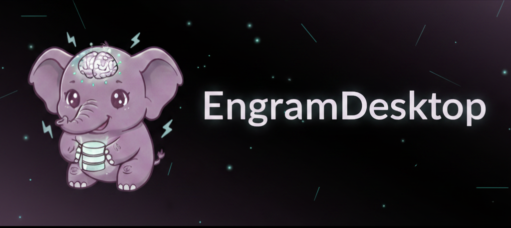

# 🎩 EngramDesktopView

> Tu dashboard para monitorear la memoria de Engram en tiempo real.

[](https://opensource.org/licenses/MIT)
[](https://tauri.app)

🧔‍♂️ Hecho con ❤️ para la comunidad de [Gentleman Programming](https://github.com/Gentleman-Programming/engram)

---

## ✨ Que puedes hacer?

- 📊 **Ver sesiones** - Todas las sesiones de tu agente en un solo lugar
- 🔍 **Buscar memorias** - Encuentra cualquier observacion al instante
- 📅 **Linea de tiempo** - Ve todos los eventos en orden cronologico
- 🌐 **3 idiomas** - Espanol, English, Portugues
- 🌓 **Tema claro/oscuro** - Elige el que mas te guste

---

## 🚀 Como empezar?

### 1. Descarga el .exe

Descarga `EngramDesktopView-1.0.0-win.zip` desde [Releases/tag](https://github.com/TatsumiDaku/engram-desktop-view/releases/latest)

### 2. Extrae y ejecuta

1. Extrae el ZIP en cualquier carpeta
2. Abre `EngramDesktopView.exe`
3. Listo!

### 4. Requiere Engram

Asegurate de tener Engram corriendo en `localhost:7437`

---

## 🔧 Como compilar desde codigo?

```bash
# Clona el repositorio
git clone https://github.com/TatsumiDaku/engram-desktop-view.git
cd engram-desktop-view

# Instala dependencias
npm install

# Compila
npm run tauri build
```

El archivo .exe estará en `src-tauri/target/release/`

---

## 🐧 Linux?

Revisa [INSTALL.md](INSTALL.md) para instrucciones de instalacion en Linux.

---

## 📝 Tecnologias

- **Frontend**: React + TypeScript + TailwindCSS
- **Desktop**: Tauri v2 (Rust)
- **Estado**: Zustand + TanStack Query
- **Backend de memoria**: [Engram](https://github.com/Gentleman-Programming/engram)

---

## 🤝 Contribuir

Issues y PRs bienvenidos!

## 📄 Licencia

MIT

---

<p align="center">
🎩 EngramDesktopView • TatsumiDaku
</p>
